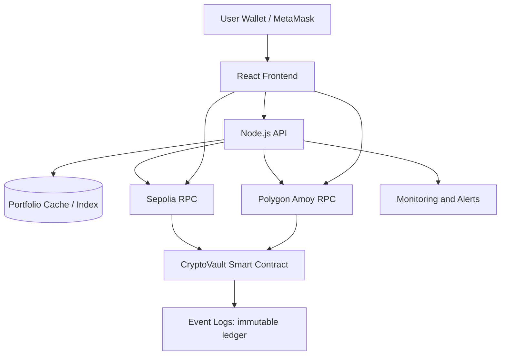

# CryptoVault Architecture

## Why Blockchain vs Centralized Ledger

CryptoVault uses blockchain because users need verifiable, tamper-resistant transaction records and trust-minimized approval workflows. A centralized database can enforce permissions but cannot provide immutable settlement guarantees without requiring trust in a single operator.

## Trade-offs

- Gas fees: On-chain operations incur execution fees, especially for multisig approvals and state updates.
- Latency: Finality depends on network block times and congestion.
- Scalability: Layer-2 and sidechains improve throughput but increase bridge and network complexity.

## System Diagram

## Clean Architecture

- Smart contract layer: Security-critical consensus logic.
- Backend layer: Off-chain indexing, auth, and analytics composition.
- Frontend layer: Wallet UX, portfolio visualization, and transaction orchestration.
- Cross-cutting concerns: Monitoring, keyless wallet auth, and role-based controls.
